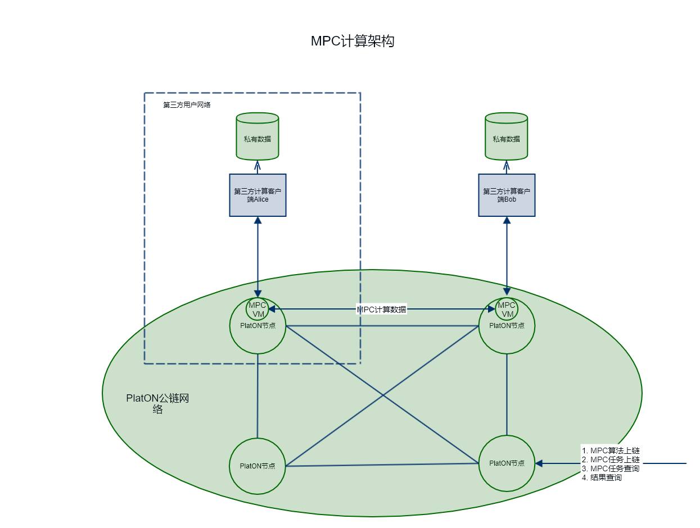
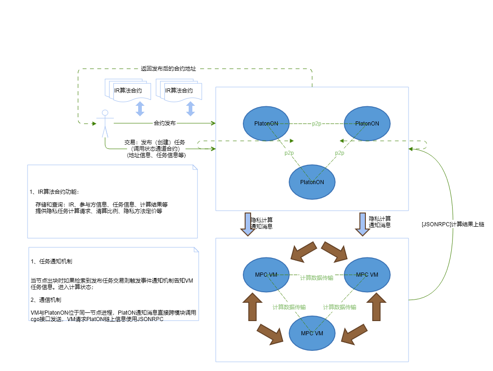
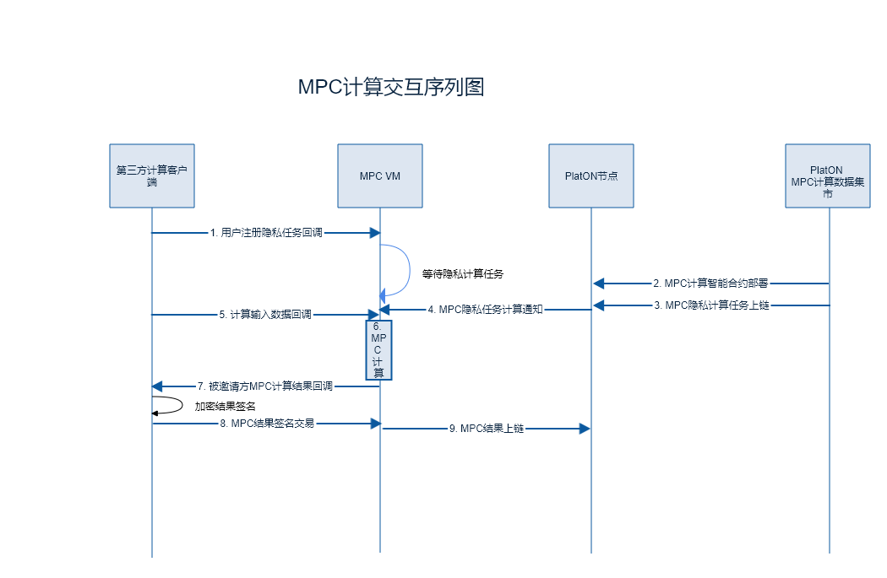
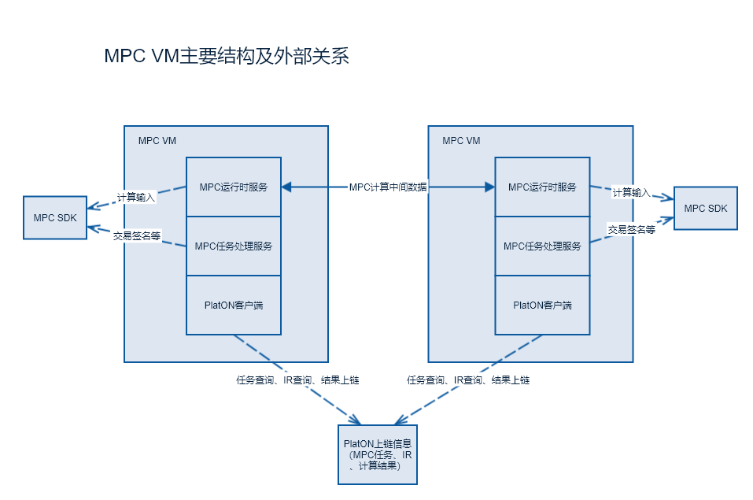
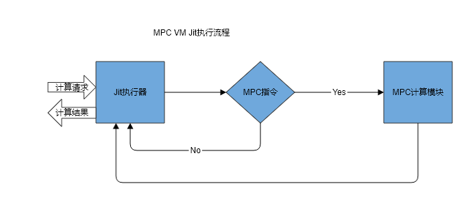

[TOC]
# PlatON MPC VM计算集成方案
---

## 1. 概述

PlatON平台作为下一代Trustless安全数据计算架构，为实现私密计算提供了基础设施。PlatON公链网络和外部计算网络组合成一个数据为中心的复合网络，为用户提供安全计算服务，实现数据的价值的流动。这个PlatON这个平台上，MPC计算虚拟机（MPC VM）作为PlatON计算架构中作为关键组件，提供了MPC计算任务的动态执行环境。

## 2. 总体设计

PlatON MPC的总体架构图如下：



### 2.1. 组件说明
PlatON节点，PlatON公链节点程序，提供区块链的交易同步、打包交易、区块同步、区块共识等服务。
MPC VM，MPC计算运行虚拟机，提供MPC计算服务，作为PlatON节点组件；
第三方计算客户端， 使用PlatON SDK参与MPC计算，提供计算数据；

### 2.2. PlatON底层如何支持MPC
PlatON公链节点使用内部任务发布机制，将新的MPC计算任务通知给MPC VM，包括MPC计算任务的ID、参与者信息等交易信息，MPC VM准备好多方安全的计算环境后，对计算任务依次进行调度、MPC计算执行。

PlatON MPC网络各组件交互图：




MPC计算序列图如下：




**前置条件**：
* 编译好MPC合约;
* 编译出MPC合约IR和MPC计算智能合约（WASM）

**MPC计算交互步骤**：
1. 用户注册任务回到MPC VM
数据提供方作为用户，注册绑定一个PlatON的MPC VM执行环境，然后等待参与的MPC计算；

2. MPC计算智能合约上链
智能合约上链，通过发布智能合约交易实现，通过**JSONRPC**接口实现；
3. MPC隐私计算任务上链
外部用户通过MPC公链节点，发布一个指定MPC计算智能合约的计算请求交易，该交易最终将会被打包、上链；

4. 隐私计算任务通知
PlatON节点发现有新的计算任务交易，将任务信息通知给MPC VM，以触发MPC VM进行任务准备和任务执行；

5. 计算输入数据回调
MPC VM在开始MPC计算前，需要数据提供方将数据输入到安全计算通道;
6. MPC计算
这个过程通过调用MPC VM底层的Jit编译执行器，并最终调用MPC的安全传输协议和加密计算协议进行运算，得到MPC的运算结果;

7. MPC计算结果回调
计算结果需要由MPC计算结果获取者传递到计算参与的数据提供方，是的数据提供方能够进行记录或其他操作;

8. MPC结果交易结果签名
MPC结果使用MPC计算任务提交者的公钥加密后，构建一个交易，将这个交易回调给数据提供方进行签名处理;

9. MCP签名结果上链
MPC结果通过JSONRPC接口，发送RawTransaction上链。


***说明： 1,2步骤可以顺序没有先后要求***

## 3. MPC VM设计
MPC VM主要分为三大模块： MPC运行时服务， MPC任务处理调度服务， PlatON客户端。
模块的组成及关系图如下：



### 3.1. MPC运行时服务
本模块主要提供MPC计算任务的虚拟机运行环境，包括计算接口IR代码解释执行、MPC计算指令执行OT传输、GC计算等。

运行时服务执行流程：


3.2.MPC任务处理调度服务
MPC 任务处理调度服务主要服务外部SDK和内部PlatON节点，对外提供对用户MPC算法任务订阅、任务回调、交易再处理；对PlatON节点作为MPC接收通知消息，然后在通过JSONRPC方式查询交易计算任务详细信息。

3.3.PlatON客户端
PlatON客户端和PlatON节点进行通信，  主要通过类似合约call的接口，获取MPC任务信息、MPC结果交易上链等功能，实际上即JSONRPC客户端SDK（类似web3j）

## 4. 智能合约规范
MPC算法提供者，通过编写的MPC合约，使用编译器生成MPC计算智能合约
### 提供的关键的字段
| 字段	|  类型	 |  含义	| 说明 |
|:-------:|:-------------:|:------:|:------:|
| owner |  string | MPC算法发布者 | 发布任务者的钱包地址 |
| ir    |  string | IR字节码 | MPC合约编译的编译生成的IR（默认为十六制造表示字节码） |
| invitor|  string | MPC邀请者	 | 发布任务者的钱包地址 |
| parties|  string[] | 参与计算用户列表 | 参与方的用户钱包地址列表 |
| urls|  string[] | MPC算法发布者 | 使用的host:port地址的参与者地址列表 |
| fees|  map<string,int> | 方法费用表 | 方法费用表，一个方法对应一个费用 |
| calculations|  map<string,security_calculation> | MPC隐私计算表 | 使用taskid关联到隐私计算（**security_calculation**）映射表 |

### 隐私计算结构
```
struct security_calculation {
string taskid;
string pubkey;
string method;
int fee;
string extra;
};
```

### 公共接口
```c++
/*
* 初始化，构造合约对象, 这些填充参数需要在编译或部署的时候，由外部提供配置参数
*/
//void init(string IR, string invitor, string[] parties, string[] urls, map<string, int> fees)  
//暂时使用init(void)版本
void init()

/* 
* 指定隐私算法接口费用，参照设置的定费用表
*/
uint64_t get_fee(const char* method) 

/* 
* 调整费用表，对存在的方法费用更新，不存在的费用添加进来，不删除已有费用
*/
//void set_fees(map<string, int> fees) 
/// 红利分配规则，字符串模拟k-v键值对
/// 格式：k1:v1,k2:v2,k3:v3 , 使用k-k-v模式进行存储
void set_fees(const char* fees)

/*
* 发起MPC计算请求，内部会对应生成一个taskid，交易中value字段指定 质押token数目
*/
void start_calc(const char* method, const char* extra)  

/*
* 设置计算结果，对质押的token按照费用扣除，扣除的费用在按照收益比例分配token，结果将由参与者（Bob角色）计算完成设置 
*/
void set_result(const char* taskid, const char* result, int state) 

/*
* 获取收益比例(%百分比为单位)， 此接口使用配置参数生成，在分配收益会调用，同样外部也可以查询
* 例如：  
* 如果part1: 40%，如果part1: 60%
* return msg.sender == part1 ? 40 : 60
*/
uint64_t calculation_share(string method) 

/*
* 获取ir合约地址
*/
string get_ir_data() const

/* 
* 查询参与者地址列表，返回为"address1","address2" 
*/
string get_participants() const

/*
* 获取指定用户地址的节点url
*/
string get_url_by_id(const char* address) const
string get_urls() const

/*
* 查询加密计算后的计算结果result
*/
string get_result() const

/*
* 查询合约执行状态
*/
int get_state() const

/*
* 查询invitor地址
*/
string get_invitor() const


/*
* 查询费用
*/
int get_fee(const string& address) const
```


## 5.接口设计
### 5.1. MPC SDK与MPC VM接口
使用ICE通信，接口定义如下（slice定义）：
```slice
[["java:package:net.platon.mpc"]]

module platon {

    enum ErrorEnum {
        NoError             = 0,
        SystemError         = 100,
        ConnectionError     = 1001,
        UserPermissionError = 1002,
        TaskNotFound        = 1005,
        NoParticipant       = 1006,
        SomeOneOffline      = 1007,
        SomeOneRejectTask   = 1008,
        TaskExecTimeout     = 1011,
        TaskInputInvalid    = 1012,
        TaskExecError       = 1013,
    };

    enum MPCRole {
        ALICE   = 1,
        BOB     = 2,
        GREEN   = 3,
        NOBODY  = 4
    };

    sequence<byte> ByteList;
    sequence<string> StringList;
    
    module callback {

        struct MpcRequest {
            string      customer;
            string      task_id;
            string      ir_hash;
            string      method;
            MPCRole     role;
            StringList  peers; 
        };

        interface TaskCallback{
            /* 错误通知 */
            void error(MpcRequest request, ErrorEnum error);

            /* 通知输入数据 */
            ErrorEnum inputData(MpcRequest request, out ByteList data);

            /* 结果通知 */
            void result(MpcRequest request, ByteList data);
        };
        
        interface TransactionCallback {
            /* 交易签名 */
            string signTransaction(string transaction);
        };
    };

    module service {

        interface TaskSession{
            /* 注册如存在，则覆盖 */
            void registTransactionCallback(string user_address, callback::TransactionCallback* cb);
            string registerIR(string ir_hash, callback::TaskCallback* cb);
        };

        interface NodeChannelSession {
            /* 从对方读取输入数据 */
            void input(ByteList data);
            void error(string taskId, MPCRole role, string from, ErrorEnum error);
        };
    };

};
```

### 5.2. MPC VM与PlatON接口
MPC VM请求PlatON节点采用JSONRPC方式通信，PlatON节点主动通知MPC VM采用跨语言接口直接调用，MPC VM以动态库的形式注入PlatON Go程序。


**PlatON通知VM接口（c++）：**
1. 隐私算法任务发布通知
void notify_security_calculation(const char* taskid, const char* pubkey, const char* address, const char* ir_address, const char* method, const char* extra)

**VM请求PlatON接口（JSONRPC）:**
1. 发送签名交易上链
sendRawTransaction
2. 请求合约查询接口
call

## 6. 代码生成
代码生成包括三部分：
### 6.1. MPC合约IR
MPC合约即MPC算法脚本， 使用c++语法编写，类型的定义使用Google Protobuf，需要使用PlatON定制的的clang编译器，编译输出IR中间代码

### 6.2. MPC 计算智能合约
智能合约使用WASM规范编写合约，语法与c++一致。PlatON MPC对应的MPC计算智能合约由编译器生成，提供标准化可以配置文件进行用户自定义定制。

### 6.3. MPC合约数据客户端代理类
MPC合约代表着实际的MPC运算语义， 为了方便数据提供方调用，PlatON定制的编译器同样能够提供代理类。


