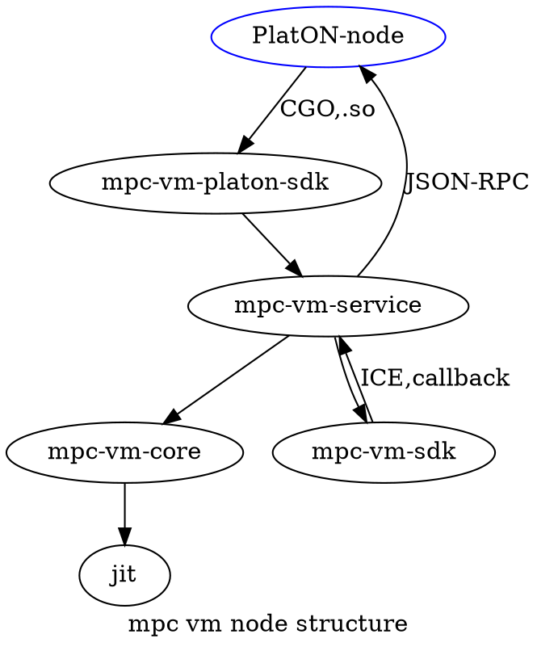

## Overview

- sub-projects
  - [mpc-vm-common](mpc-vm-common/README.md) mpc common.
  - [mpc-vm-core](mpc-vm-core/README.md) mpc core.
  - [mpc-vm-service](mpc-vm-service/README.md) mpc service.
  - [mpc-vm-platon-sdk](mpc-vm-platon-sdk/README.md) for platon call this with cgo.
  - [mpc-vm-sdk](mpc-vm-sdk/README.md) data-provider c++ sdk, base on ice.

---
if you can not see a graph, [click here](../docs/images/mpc-vm-node-structure.png).

---
