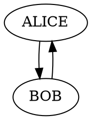
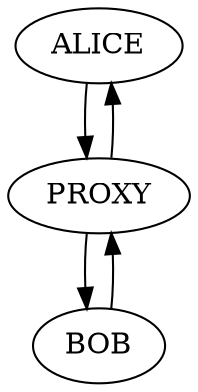

# mpc vm service

### 1

```dot
digraph G{
ALICE -> BOB;
BOB -> ALICE;
}
```

### 2

```dot
digraph G{
ALICE -> PROXY -> BOB;
BOB -> PROXY -> ALICE;
}
```

MpcTaskDispatcher
    init some MpcTaskProcessor

When a task is committed, whichever node.
1. alice or bob

